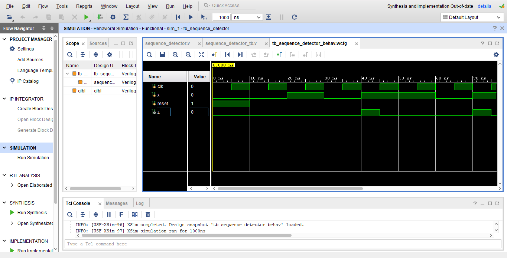

# Sequence Detector for "101"

This project implements a sequence detector for the binary sequence `101` using Verilog HDL. It is based on a finite state machine (FSM) design and includes a testbench and waveform for verification.

## Files

- `sequence_detector.v` — Verilog module implementing the 101 sequence detector.
- `tb_sequence_detector.v` — Testbench for simulation and verification.
- `waveform.png` — Screenshot of the waveform showing sequence detection.

## How It Works

The FSM transitions through states based on the input bitstream (`x`) and produces an output `z = 1` when the pattern `101` is detected. The design supports overlapping sequences, meaning it can detect consecutive patterns even if they share bits.

## How to Simulate

1. Open the `.v` files in a Verilog simulator (e.g., ModelSim, Vivado, or Icarus Verilog).
2. Compile and run the testbench (`tb_sequence_detector.v`).
3. Observe the waveform output using GTKWave or the simulator’s waveform viewer.
4. Verify that `z` goes high when the input sequence `101` is detected.

## Output Waveform

 

## Features

- Moore FSM-based design
- Supports overlapping patterns
- Simple and modular Verilog structure
- Self-contained testbench included

## Tools Used

- Verilog HDL(vivado)
- Any standard Verilog simulator
- Waveform viewer (such as GTKWave)
